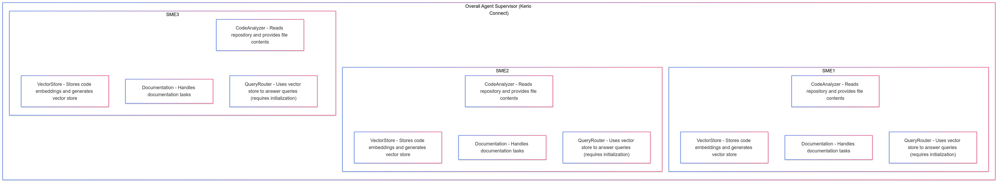

# Final Project

## What this project does?

This project is an intelligent document analysis system that combines multi-agent architecture with advanced retrieval capabilities. It leverages a supervisor agent, vector database, and RAG (Retrieval Augmented Generation) to automatically scan, index, and provide detailed answers to queries about any GitHub repository.

Demo video: https://drive.google.com/file/d/1OElIlY_fRvy7PRk001M3dCvb8d0M6hsH/view?usp=sharing

## Objective
Build a prototype of an agentic system to be used inside your company. You can utilize graphs, agents, or multi-agent systems.

## Overview of Tasks
1. **Identify Problem:**
Determine a specific problem within your company that could benefit from the application of an agentic system.
2. **Diagram a Solution:**
Create a detailed diagram outlining the proposed solution. This should include the architecture of the agentic system, the roles of different agents, and how they interact to solve the identified problem.
3. **Build Prototype:**
Develop a working prototype based on the diagrammed solution. This initial version doesn't have to be perfect but should demonstrate the core functionality and potential of the agentic system.

## Deliverables
- **Working Prototype:**
A functional prototype of the agentic system. While it doesn't have to be perfect, it should serve as a first pass and clearly illustrate the intended solution.
- **Application of Course Learnings:**
The prototype must incorporate the concepts and techniques learned throughout this course to address a real business problem within your company.

## Privacy and Submission Guidelines
- **Submission Requirements:** 
Submit a link to your public repository with your implementation or a Loom video showcasing your work on the BloomTech AI Platform.
- **Sensitive Information:** 
If your implementation involves sensitive information, you can submit a detailed review of your project through a Loom video, demonstrating the functionality and discussing the technologies used without exposing confidential data.